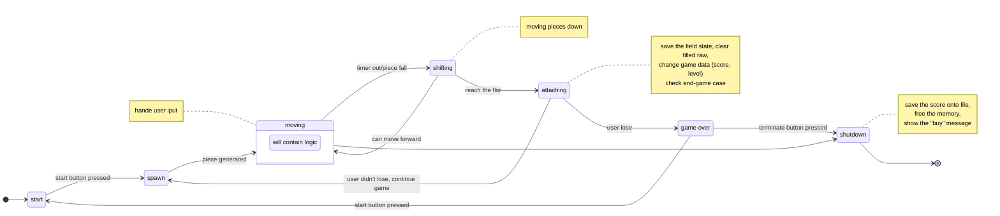

```mermaid
stateDiagram-v2
    direction LR

    [*] --> start

    start --> spawn : start button pressed
    spawn --> moving : piece generated

    state moving {
        some : will contain logic
        %% there will be logic of user input handeling 
    }
    note left of moving : hande user iput

    moving --> shifting : timer out/piece fall
    shifting --> moving : can move forward
    note right of shifting: moving pieces down

    shifting --> attaching : reach the flor
    note right of attaching
        save the field state, clear filled raw,
        change game data (score, level)
        check end-game case
    end note

    attaching --> spawn : user didn't lose, continue game
    attaching --> end : user lose

    state "game over" as end

    end --> start : start button pressed

    end --> shutdown : terminate button pressed
    note right of shutdown
        save the score onto file,
        free the memory,
        show the "buy" message
    end note

    moving --> shutdown

    shutdown --> [*]


```